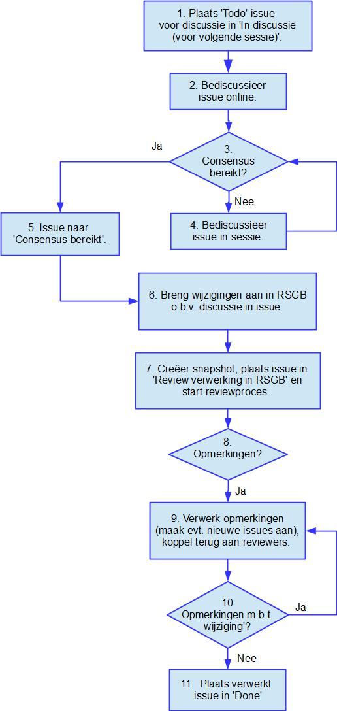

# Werkproces Actualisering RSGB

## Incrementeel creatieproces

Bij het actualiseren van  het RSGB hanteren we het hieronder geïllustreerde incrementele creatieproces. Daarbij maken we gebruik van het daarvoor ingerichte [Kanban bord](https://github.com/orgs/VNG-Realisatie/projects/24) met de in de illustratie genoemde kolommen:

1.	Todo
2.	In discussie (voor komende sessie)
3.	Consensus bereikt
4.	Review verwerking in RSGB
5.	Done

Hier hoort per issue het volgende proces bij waarbij het uitgangspunt is dat de issues in de onder handen milestone al in de 'Todo' kolom zijn geplaatst.

De genoemde review vindt plaats op het Respec document. De werkwijze daarvan is beschreven in de volgende paragraaf.

Nadat alle issues die de basis vormen voor een nieuwe RSGB versie zo zijn verwerkt en gereviewed volgt er nog een algehele reviwe waarvoor dezelfde in de volgende paragraaf beschreven werkwijze wordt gebruikt.

## Review

Een review wordt uitgevoerd op een Respec document dat in [deze repository](https://github.com/VNG-Realisatie/RSGB-Respec) wordt gegenereerd en waarin over het algemeen meerdere issues verwerkt zullen zijn. 
In dat Respec document kunnen review-opmerkingen worden geplaatst aan de hand waarvan bekeken zal worden of nieuwe issues noodzakelijk zijn of juist alleen een terugkoppeling aan de reviewer.
Voor het kunnen plaatsen van reviewopmerkingen moet echter aan enkele voorwaarden worden voldaan.

Van elk document dat we willen onderwerpen aan een uitgebreide review dient eerst een snapshot vervaardigd te worden. 

Onder een snapshot verstaan we een in de tijd bevroren status van een document met een naam waarin het tijdstip waarop het is bevroren is opgenomen. De conventie daarvoor is _[originele naam]-[yyyymmdd].html_. 

> Van een Respec document kan een snapshot vervaardigd worden door het te openen en rechtsboven op de _'Respec'_ button te klikken en vervolgens te kiezen voor _'Bewaar Snapshot...'_.
>
> 

Dit document wordt geplaatst in de folder 'snapshots'. Dan zou bijvoorbeeld het document 'snapshots/RSG_Basisgegevens_2_02-20260526.html' geöpend kunnen worden via de url https://geonovum.github.io/mim-metamodel/snapshots/RSG_Basisgegevens_2_02-20260526.
Deze url dient gedeeld te worden met de groep van personen waarvan verwacht wordt dat deze de review uitvoert. 

Deze personen maken, voor het uitvoeren van de review, gebruik van '[Hypothesis](https://web.hypothes.is/)'. 

> Hypothesis werkt in elke moderne web browser versie die gereleased is in de laatste 12 maanden. waaronder:
> 
> * Chrome
> * Firefox
> * Safari
> * Microsoft Edge
> * Opera
> * Vivaldi
> * Brave
